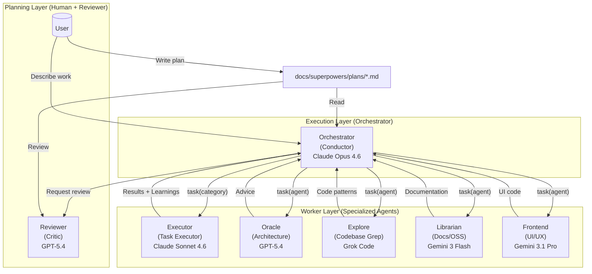
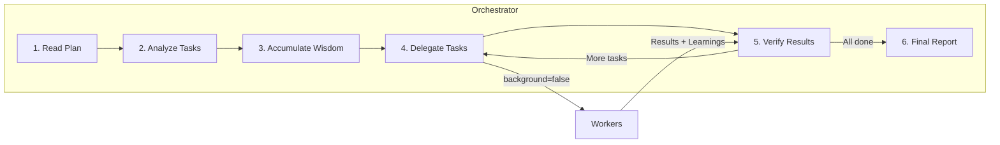

# Orchestration System Guide

opencode-codex-orch's orchestration system transforms a simple AI agent into a coordinated development team through **delegation, review, and verification**.

---

## TL;DR - When to Use What

| Complexity            | Approach                  | When to Use                                                                              |
| --------------------- | ------------------------- | ---------------------------------------------------------------------------------------- |
| **Simple**            | Just prompt               | Simple tasks, quick fixes, single-file changes                                           |
| **Complex + Direct**  | Just ask directly         | Complex tasks where you want the orchestrator to explore, implement, and verify.          |
| **Complex + Planned** | Plan → `/start-work`      | Precise, multi-step work requiring a written plan and structured execution.               |

**Decision Flow:**

```
Is it a quick fix or simple task?
  └─ YES → Just prompt normally
  └─ NO  → Do you need a written plan first?
              └─ YES → Write/review a plan, then use /start-work
              └─ NO  → Ask the orchestrator directly
```

---

## The Architecture

The orchestration system uses a three-layer architecture that solves context overload, cognitive drift, and verification gaps through specialization, delegation, and review.



---

## Planning and Review

Use a written plan when you want explicit scope, checkpoints, and a durable artifact under `docs/superpowers/plans/`.

### Reviewer

Reviewer validates plans and implementations against clarity, verifiability, and completeness. Use it before execution when you want a strong critique or after implementation when you want an independent check.

### DeepSearch

DeepSearch is the dedicated research orchestrator. Use it when the task is comparative, documentation-heavy, or needs multiple research sub-questions investigated in parallel.

---

## Execution: Orchestrator

### The Conductor Mindset

The orchestrator is like an orchestra conductor: it doesn't play instruments, it ensures the right specialists are used at the right time.



**What the orchestrator CAN do:**

- Read files to understand context
- Run commands to verify results
- Use lsp_diagnostics to check for errors
- Search patterns with grep/glob/ast-grep

**What the orchestrator MUST delegate:**

- Writing or editing code files
- Fixing bugs
- Creating tests
- Git commits

### Wisdom Accumulation

The power of orchestration is cumulative learning. After each task:

1. Extract learnings from subagent's response
2. Categorize into: Conventions, Successes, Failures, Gotchas, Commands
3. Pass forward to ALL subsequent subagents

This prevents repeating mistakes and ensures consistent patterns.

**Notepad System:**

```
.opencode/notepads/{plan-name}/
├── learnings.md      # Patterns, conventions, successful approaches
├── decisions.md      # Architectural choices and rationales
├── issues.md         # Problems, blockers, gotchas encountered
├── verification.md   # Test results, validation outcomes
└── problems.md       # Unresolved issues, technical debt
```

> **Migration note**: The legacy path `.sisyphus/notepads/` is still readable for backward compatibility.

---

## Workers: Executor and Specialists

### Executor: The Task Executor

The Executor (internally `sisyphus-junior`) is the workhorse that actually writes code. Key characteristics:

- **Focused**: Cannot delegate (blocked from task tool)
- **Disciplined**: Obsessive todo tracking
- **Verified**: Must pass lsp_diagnostics before completion
- **Constrained**: Cannot modify plan files (READ-ONLY)

**Why Sonnet is Sufficient:**

Junior doesn't need to be the smartest - it needs to be reliable. With:

1. Detailed prompts from the orchestrator (50-200 lines)
2. Accumulated wisdom passed forward
3. Clear MUST DO / MUST NOT DO constraints
4. Verification requirements

Even a mid-tier model executes precisely. The intelligence is in the **system**, not individual agents.

### System Reminder Mechanism

The hook system ensures Junior never stops halfway:

```
[SYSTEM REMINDER - TODO CONTINUATION]

You have incomplete todos! Complete ALL before responding:
- [ ] Implement user service ← IN PROGRESS
- [ ] Add validation
- [ ] Write tests

DO NOT respond until all todos are marked completed.
```

This "boulder pushing" mechanism is why the system keeps strong continuation semantics.

---

## Category + Skill System

### Why Categories are Revolutionary

**The Problem with Model Names:**

```typescript
// OLD: Model name creates distributional bias
task({ agent: "gpt-5.4", prompt: "..." }); // Model knows its limitations
task({ agent: "claude-opus-4.6", prompt: "..." }); // Different self-perception
```

**The Solution: Semantic Categories:**

```typescript
// NEW: Category describes INTENT, not implementation
task({ category: "hard", prompt: "..." }); // "Think strategically"
task({ category: "designer", prompt: "..." }); // "Design beautifully"
task({ category: "quick", prompt: "..." }); // "Just get it done fast"
```

### Built-in Categories

| Category             | Model                  | When to Use                                                 |
| -------------------- | ---------------------- | ----------------------------------------------------------- |
| `designer`           | Gemini 3.1 Pro         | Frontend, UI/UX, design, styling, animation                 |
| `hard`               | GPT-5.4 (high)         | Complex implementation, architecture, debugging, research   |
| `quick`              | Claude Haiku 4.5       | Trivial tasks - single file changes, typo fixes             |

### Skills: Domain-Specific Instructions

Skills prepend specialized instructions to subagent prompts:

```typescript
// Category + Skill combination
task(
  (category = "designer"),
  (load_skills = ["frontend-ui-ux"]), // Adds UI/UX expertise
  (prompt = "..."),
);

task(
  (category = "general"),
  (load_skills = ["playwright"]), // Adds browser automation expertise
  (prompt = "..."),
);
```

---

## Usage Patterns

### How to Work With Plans

**Method 1: Prepare a canonical plan file**

```
1. Create or review a plan under `docs/superpowers/plans/`
2. Make sure it matches the intended scope
3. Run `/start-work`
```

**Method 2: Start directly from the latest plan**

```
1. Stay in the orchestrator
2. Run `/start-work [plan-name]`
3. The orchestrator reads the plan from `docs/superpowers/plans/`
4. Execution continues with boulder state in `.opencode`
```

**Which Should You Use?**

| Scenario                          | Recommended Method         | Why                                                  |
| --------------------------------- | -------------------------- | ---------------------------------------------------- |
| **New session, starting fresh**        | Prepare a plan first     | Clean mental model before execution                  |
| **Already in the Orchestrator, mid-work** | Run `/start-work`       | Convenient continuation from current context         |
| **Want explicit control**              | Review the plan manually | Clear separation of planning vs execution contexts   |
| **Quick structured execution**         | Run `/start-work`        | Fastest path from plan to execution                  |

Both methods lead to the same canonical `/start-work` execution flow.

### /start-work Behavior and Session Continuity

**What Happens When You Run /start-work:**

```
User: /start-work
    ↓
[start-work hook activates]
    ↓
Check: Does .opencode/boulder.json exist?
    ↓
    ├─ YES (existing work) → RESUME MODE
    │   - Read the existing boulder state
    │   - Calculate progress (checked vs unchecked boxes)
    │   - Inject continuation prompt with remaining tasks
    │   - The orchestrator continues where you left off
    │
    └─ NO (fresh start) → INIT MODE
        - Find the most recent plan in docs/superpowers/plans/
        - Create new boulder.json tracking this plan
        - Continue execution with the orchestrator runtime
        - Begin execution from task 1
```

**Session Continuity Explained:**

The `boulder.json` file tracks:

- **active_plan**: Path to the current plan file
- **session_ids**: All sessions that have worked on this plan
- **started_at**: When work began
- **plan_name**: Human-readable plan identifier

**Example Timeline:**

```
Monday 9:00 AM
  └─ @plan "Build user authentication"
  └─ Plan is created and saved
  └─ User: /start-work
  └─ Orchestrator begins execution, creates boulder.json
  └─ Task 1 complete, Task 2 in progress...
  └─ [Session ends - computer crash, user logout, etc.]

Monday 2:00 PM (NEW SESSION)
  └─ User opens new session (agent = Orchestrator by default)
  └─ User: /start-work
  └─ [start-work hook reads boulder.json]
  └─ "Resuming 'Build user authentication' - 3 of 8 tasks complete"
  └─ Orchestrator continues from Task 3 (no context lost)
```

The canonical execution flow is activated when you run `/start-work`.

### Direct Orchestrator Requests

For most tasks, just ask the orchestrator directly. Use `/start-work` when you want execution to follow a saved plan.

---

## Configuration

You can control related features in `opencode-codex-orch.json`:

```json
{
  "orchestrator_agent": {
    "disabled": false,
    "planner_enabled": false,
    "replace_plan": false
  },

  "disabled_hooks": ["start-work"]
}
```

---

## Troubleshooting

### "/start-work says 'no active plan found'"

Either:

- No plans exist in `docs/superpowers/plans/` → Create or add one first
- Plans exist but boulder.json points elsewhere → Delete `.opencode/boulder.json` and retry

### "How do I stop the continuation flow?"

Use `/stop-continuation` to clear the current boulder/todo continuation state for the session.

---

## Further Reading

- [Overview](./overview.md)
- [Features Reference](../reference/features.md)
- [Configuration Reference](../reference/configuration.md)
- [Manifesto](../manifesto.md)
